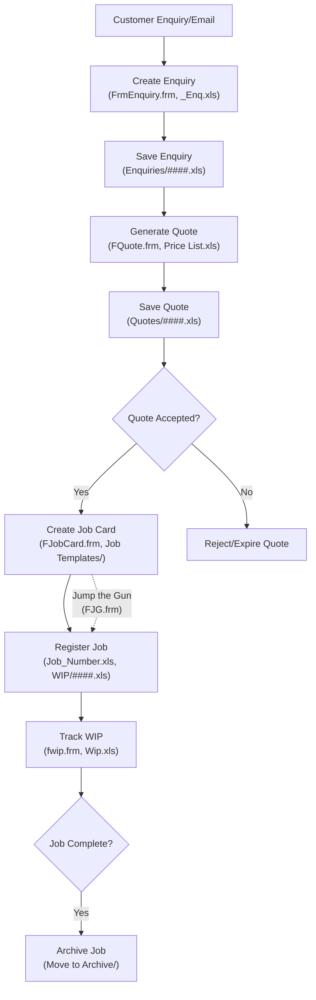

# PCS - Production Control System

## Overview

The Production Control System (PCS) is a legacy business management application built using Microsoft Excel and Visual Basic for Applications (VBA). It was designed to handle manufacturing workflows, including customer enquiries, quote generation, job management, contract handling, and work-in-progress (WIP) tracking. The system relies on a file-based architecture where data is stored in individual Excel files organized by directories, rather than a centralized database. This approach allows for modular management but introduces performance limitations as data volumes grow.

PCS serves as a complete job and quote management system, supporting workflows from initial customer contact through to job completion and archiving. It is optimized for small-scale manufacturing environments with 3-5 concurrent users, emphasizing simplicity and familiarity with Excel interfaces.

**Key Characteristics:**
- **Technology Stack**: Microsoft Excel (primarily .xls format, compatible with Excel 2003-2010), VBA for automation and logic.
- **Data Storage**: File-based (individual .xls files per record), organized in directories.
- **User Interface**: Forms-based (e.g., Main.frm for dashboard), with buttons, lists, and previews.
- **Dependencies**: Local file system access; no external databases, APIs, or internet connectivity required.
- **Limitations**: Single-threaded VBA operations can lead to delays (e.g., 10-30 seconds for searches); relies on file system security; no built-in multi-user locking beyond basic file handling.

The system is no longer under active development but remains operational as a stopgap solution. It provides a foundation for understanding legacy workflows before potential modernization.

## Directory Structure

The system is organized into directories for data separation and modularity:

- **Archive/**: Completed or historical jobs (e.g., moved WIP files like 284446.xls).
- **Contracts/**: Contract records (e.g., ACT_11_4_SPRING_WASHERS.xls).
- **Customers/**: Individual customer files (e.g., ACRON_ENGINEERING.xls).
- **Enquiries/**: Enquiry records (e.g., 384775.xls).
- **Job Templates/**: Standardized job card templates (e.g., A_Gen_Job_Card.xls).
- **Quotes/**: Quote files (e.g., 284139.xls).
- **Templates/**: Shared templates for enquiries, jobs, operations, pricing (e.g., _Enq.xls, Price_List.xls).
- **VBA/**: Extracted VBA code from Excel files (e.g., _Interface.xls.vba).
- **WIP/**: Work-in-progress files (e.g., 29784.xls).

Additional root-level files:
- `_Interface.xls` (or Interface.xls): Main dashboard and entry point.
- `Search.xls`: Search functionality across the system.
- `Operation.xls` / `Operations.xls`: Operational workflows.
- `Wip.xls`: WIP tracking interface.

**Note on File Naming**: Files often use numeric IDs (e.g., 384775.xls for enquiries) generated sequentially. Some macros may expect specific naming conventions (e.g., no spaces); refer to directory changes.md for compatibility fixes if errors occur.

## Key Components

### Main Interface (_Interface.xls)
- Central hub with VBA modules (e.g., Main.frm).
- Features: Filters, lists, status counts, quick actions, preview panels, and action buttons.
- Core VBA modules: a_ListFiles.bas (file listing), GetValue.bas (cross-file data retrieval), RefreshMain.bas (UI updates), Module1.bas (search sync).

### Search Engine (Search.xls)
- Custom VBA-based search for cross-system queries.
- Indexes data from enquiries, quotes, WIP, etc.
- Limitations: Linear scanning leads to slow performance on large datasets.

### Forms and User Interfaces
- **FrmEnquiry.frm**: Captures new enquiries.
- **FQuote.frm**: Generates quotes from enquiries.
- **FJobCard.frm**: Manages job cards and operations.
- **FAcceptQuote.frm**: Handles quote acceptance to jobs.
- **fwip.frm**: WIP reporting.
- **FJG.frm**: Urgent job handling ("Jump the Gun").
- **FList.frm**: Displays record lists.

### Data Management
- **Templates**: Used to create new records (e.g., _Enq.xls for enquiries).
- **Utilities**: VBA functions like Calc_Numbers (ID generation), SaveFileCode (file saving), Check_Dir (directory management).

### Other Components
- **Job_Number.xls**: Tracks job sequencing.
- **Price List.xls**: Pricing templates.
- Customer and contract files: Contain specific data like contacts, codes, grades, quantities, and comments.

## How It Works

### Core Workflows

PCS follows a linear workflow from customer enquiry to job completion, with branching for multiple quotes or urgent jobs.

1. **Enquiry Management**:
   - Start with a customer email or request.
   - Use FrmEnquiry.frm to create a new enquiry from _Enq.xls template.
   - Assign a unique Enquiry # (e.g., via Calc_Numbers).
   - Save as a numeric file in Enquiries/ (e.g., 384775.xls).
   - Fields: Customer, Contact, Code, Grade, Description, Qty, Comments, Drw/Sample #, Enq Date.

2. **Quote Generation**:
   - Select an enquiry in the main interface.
   - Use FQuote.frm to convert to a quote.
   - Calculate prices using templates (e.g., Price List.xls).
   - Save as a numeric file in Quotes/ (e.g., 284139.xls).
   - Fields added: Quote #, Price, Lead Time.

3. **Quote Acceptance and Job Creation**:
   - Mark quote as submitted/accepted via FAcceptQuote.frm.
   - Convert to a job using FJobCard.frm.
   - Assign Job #, Job Start Date.
   - Create job card from Job Templates/ (e.g., A Gen Job Card.xls).
   - Save in WIP/ (e.g., 29784.xls).
   - Optional: "Jump the Gun" for urgent jobs via FJG.frm (bypasses quote acceptance).

4. **Work-in-Progress (WIP) Tracking**:
   - Use fwip.frm or Wip.xls to monitor active jobs.
   - Update status, operations, hours, operators.
   - Fields: Status (e.g., WIP to be Sequenced, Jobs In WIP), Inv #.
   - Generate reports (e.g., WIP Report).

5. **Completion and Archiving**:
   - Mark job as complete via Close Job button.
   - Move file to Archive/.
   - View history via Job History or Quote History buttons.

### Search and Navigation
- Use Search.frm for queries across directories.
- Filters in main interface: New Enquiries, Quotes to be Submitted, WIP to be Sequenced, Jobs In WIP.
- Preview panel shows selected item details.
- Quick actions: Contract Work, Show Contracts Folder.

### Data Flow
- VBA handles data transfer between files (e.g., GetValue retrieves from closed workbooks).
- Real-time updates via Check_Updates (polls file changes) and RefreshMain.
- No direct cell linking; data is read/written programmatically.

### Workflow Diagram

## Usage Notes

1. **Getting Started**:
   - Open _Interface.xls as the main entry point.
   - Enable macros in Excel (required for functionality).
   - Navigate via the dashboard: Select filters, view lists, preview items, and use action buttons.

2. **Creating Records**:
   - Always start from templates to maintain structure.
   - Use Add Enquiry or Convert to Quote buttons.

3. **Searching**:
   - Open Search interface via button.
   - Results based on file content; may take time on large systems.

4. **Maintenance**:
   - Manual backups: Copy entire directory structure regularly.
   - Monitor for file locking issues in multi-user setups.
   - Fix 64-bit compatibility if using modern Excel (e.g., pointer issues).

5. **VBA Code Analysis**:
   - Code extracted using tools like oledump.py (see README.md in provided documents).
   - Modules are in VBA/ directory for review.

## Technical Limitations

- **Performance**: Slow searches (10-30s) due to linear file scanning; delays in file operations (3-5s).
- **Scalability**: Not designed for large datasets or high concurrency.
- **Security**: Relies on file system permissions; no encryption or user roles.
- **Error Handling**: Basic; may show VBA errors without recovery.
- **Compatibility**: Best on older Excel versions; potential issues on 64-bit systems or macOS.

## Additional Resources

- **SYSTEM.md**: Detailed architecture and module breakdown.
- **pcsDocumentation.md**: Workflow diagrams and step-by-step guides.
- **README.md (original)**: Basic setup and VBA extraction instructions.

For upgrades or modernization, refer to separate specification documents (e.g., PCS_Interface_Upgrades.md). This README focuses solely on the existing system's context and operation.