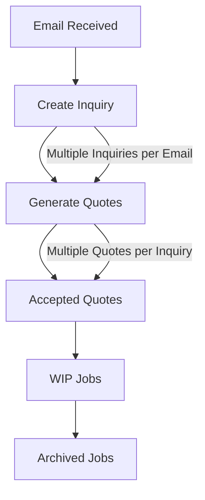
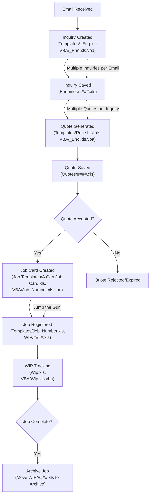

# PCS (Production Control System) Documentation

A legacy shop management and production control system implemented primarily in Microsoft Excel with VBA macros and structured templates.

## System Overview

The PCS (Production Control System) was designed to manage inventory, jobs, operations, customers, contracts, and work-in-progress (WIP) for a manufacturing environment. The system is composed of multiple Excel workbooks, templates, and VBA scripts, organized into functional directories.

## Directory Structure

- **2008blabla/**: Main system files, templates, and data sheets
  - **Contracts/**: Contract templates and records
  - **Customers/**: Customer data and records
  - **Enquiries/**: Enquiry records and templates
  - **Job Templates/**: Standard job card templates
  - **Templates/**: Shared templates for clients, jobs, operations, and pricing
  - **VBA/**: VBA macro code for automation and business logic
  - **WIP/**: Work-in-progress tracking files
- **pcsDocumentation.md**: This documentation file

## Key Components

- **Excel Workbooks**: Each workbook (e.g., _Interface.xls, Operation.xls, Wip.xls) represents a module such as job management, operations, or WIP tracking.
- **VBA Macros**: Automation and business logic are implemented in .vba files, which are linked to their respective Excel workbooks.
- **Templates**: Standardized forms for data entry, job cards, customer records, and pricing.

## Main Modules

- **Job Management**: Track job cards, job numbers, due dates, and workshop assignments.
- **Operations**: Define and manage manufacturing operations and operator assignments.
- **Inventory & Components**: Manage component grades, stock, and pricing.
- **Customer & Contract Management**: Store customer details and contract records.
- **WIP Tracking**: Monitor work-in-progress, including quantities, dates, and operator activity.
- **Enquiries**: Record and manage customer enquiries and quotations.

## How to Use

1. Open the relevant Excel workbook for the module you wish to use (e.g., Job_Number.xls for job management).
2. Use the provided templates for consistent data entry and reporting.
3. Macros (VBA) automate repetitive tasks—ensure macros are enabled in Excel.
4. Data is organized by year, customer, or job as appropriate in subfolders.

## Notes

- This system is intended for use with Microsoft Excel (with macro support enabled).
- Data integrity and backup are manual processes—regularly save and backup files.
- For details on specific modules, refer to the README.md or SYSTEM.md files in each subfolder.

## Migration Guidance

For migration to the new system, review the structure and logic in the VBA/ and Templates/ folders. Key business rules and workflows are embedded in the macro code and template layouts.

## System Workflow

This diagram shows the typical flow: customer emails lead to one or more inquiries, each inquiry can generate multiple quotes, accepted quotes become WIP jobs, and completed jobs are archived.

## Detailed System Workflow

### Step-by-Step Workflow with File References

1. **Email Received**
   - Customer sends an email with an inquiry.
   - Operator reviews the email and initiates a new inquiry in the system.

2. **Inquiry Creation**
   - Use `Templates/_Enq.xls` as the template for a new inquiry.
   - VBA macro in `VBA/_Enq.xls.vba` automates copying the template and assigning a unique inquiry number.
   - Inquiry is saved as a new file in `Enquiries/` (e.g., `Enquiries/384774.xls`).

3. **Quote Generation**
   - From the inquiry file, operator uses the macro (in `VBA/_Enq.xls.vba`) to generate one or more quotes.
   - Quotes are based on `Templates/Price List.xls` and may use customer-specific pricing.
   - Each quote is saved as a new file in a `Quotes/` directory (not shown in structure, but implied by workflow).

4. **Quote Acceptance**
   - If a customer accepts a quote, operator uses the macro in `VBA/Job_Number.xls.vba` to create a job card.
   - Job card is based on a template from `Job Templates/` (e.g., `A Gen Job Card.xls`).
   - Job is registered in `Templates/Job_Number.xls` and a WIP file is created in `WIP/` (e.g., `WIP/29734.xls`).

5. **WIP Tracking**
   - Ongoing jobs are tracked in `Wip.xls` using macros in `VBA/Wip.xls.vba`.
   - Operators update status, quantities, and completion dates.

6. **Archiving**
   - When a job is complete, the WIP file is moved to an archive folder for record-keeping.
   - Archiving may be manual or automated via macro.

### Special Features and Implementation Details

- **Templates**: All new records (inquiries, quotes, jobs) are created from standardized templates in `Templates/` or `Job Templates/`. Macros automate copying and renaming.
- **Jump the Gun**: If production must start before formal quote acceptance, operator uses a job template to create a provisional job card and WIP entry. This is tracked in `WIP/` and updated once the quote is accepted.
- **VBA Automation**: Key macros are found in the `VBA/` directory, named after their associated Excel files. For example, `VBA/_Enq.xls.vba` automates inquiry and quote creation, while `VBA/Job_Number.xls.vba` handles job registration.
- **Manual Data Entry**: Operators fill in details in the Excel files, using dropdowns and validation rules defined in the templates.
- **Archiving**: Completed jobs are moved from `WIP/` to an archive folder, either manually or via macro.

---

For further details, see the SYSTEM.md and README.md files in the 20081222/ directory.

For a detailed explanation of the VBA scripts in `Interface.xls`, see [VBA Scripts Explanation](./20081222/VBA/VBA_Explanation.md).
